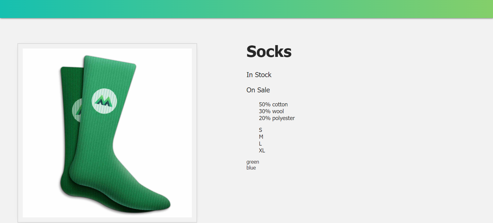

# Vue Mastery Socks App
_This is to learn the fundamentals of Vue.js and build an app to put these concepts in practice, this from the Vue Mastery course_

The current display of the app is as follows:

